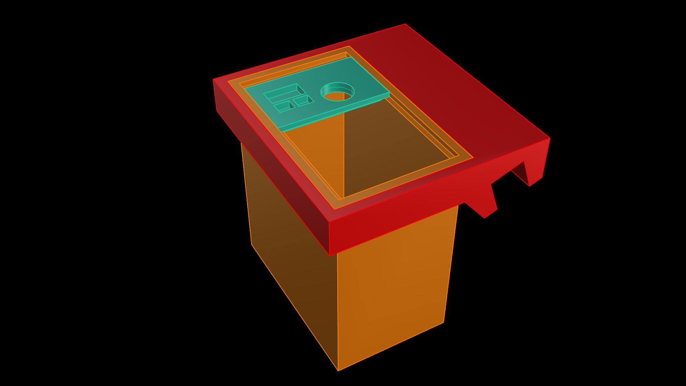
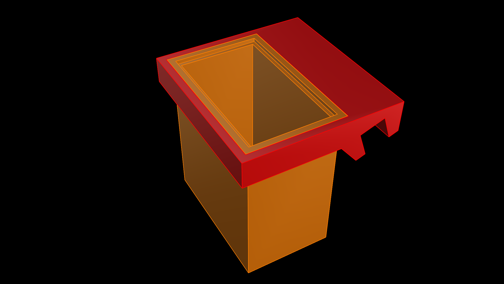
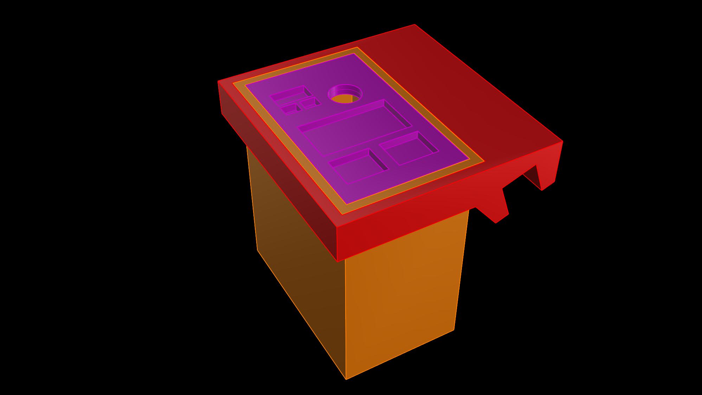
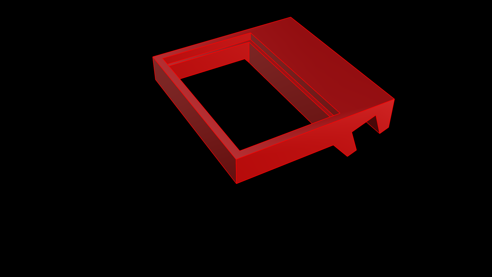
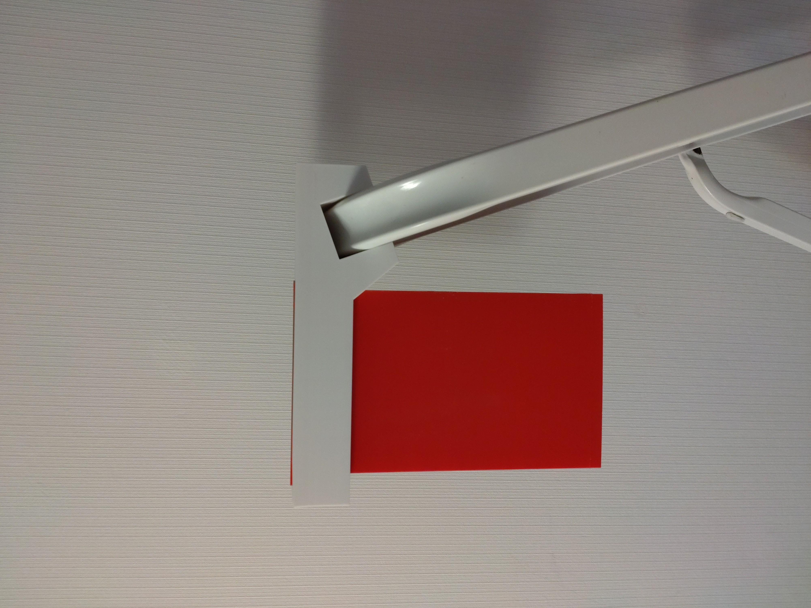
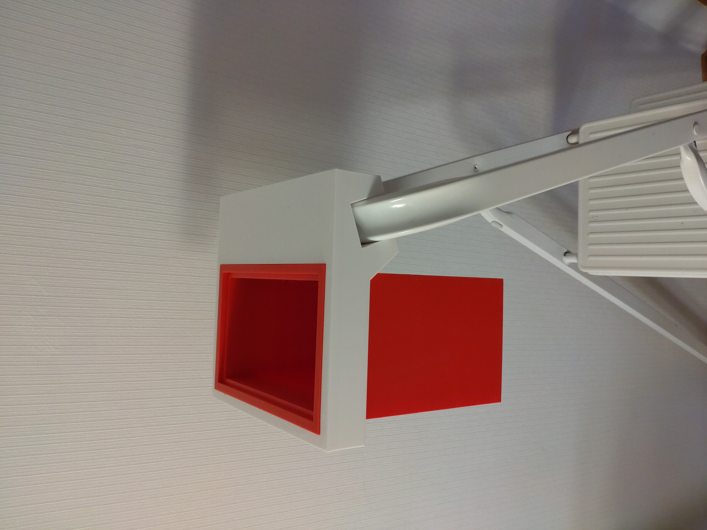
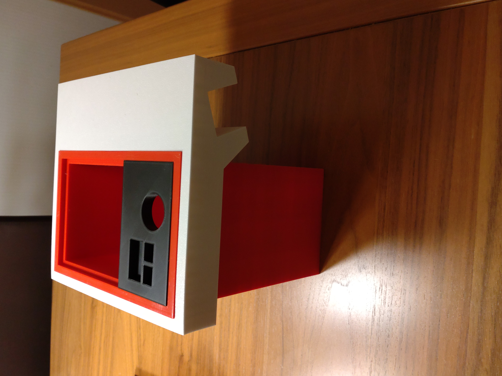

# Ladder-Tray-Box
3D printable Tray and Box for a ladder. Created in Rhino 8.
You can mount it on top of a ladder.

Requirements:
* 3D printer 
* Filament of your choice (I use PETG)

## View

 

  

 
 
 

